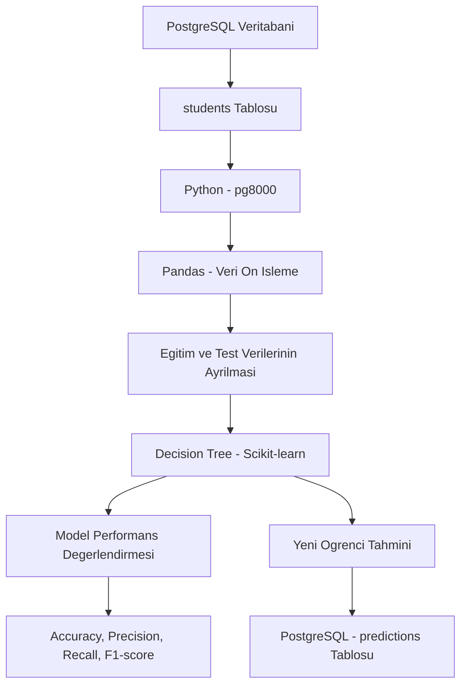

```mermaid
flowchart TD
    A["PostgreSQL Veritabani"] --> B["students Tablosu"]
    B --> C["Python - pg8000"]
    C --> D["Pandas - Veri On Isleme"]
    D --> E["Egitim ve Test Verilerinin Ayrilmasi"]
    E --> F["Decision Tree - Scikit-learn"]
    F --> G["Model Performans Degerlendirmesi"]
    G --> H["Accuracy, Precision, Recall, F1-score"]
    F --> I["Yeni Ogrenci Tahmini"]
    I --> J["PostgreSQL - predictions Tablosu"]
```
